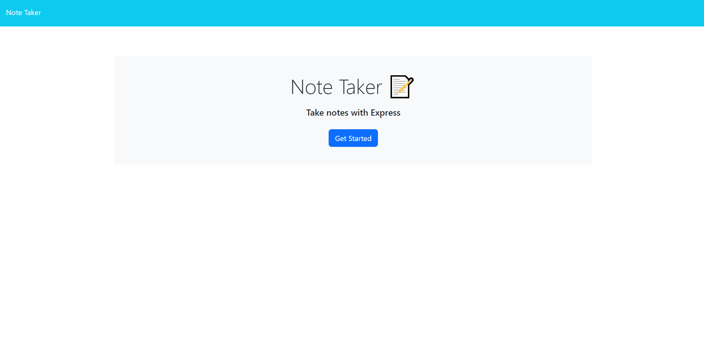
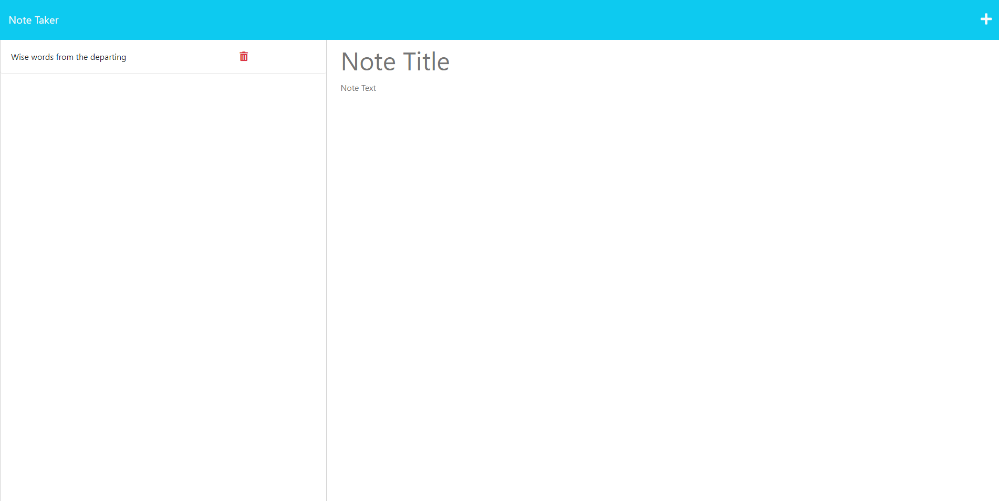
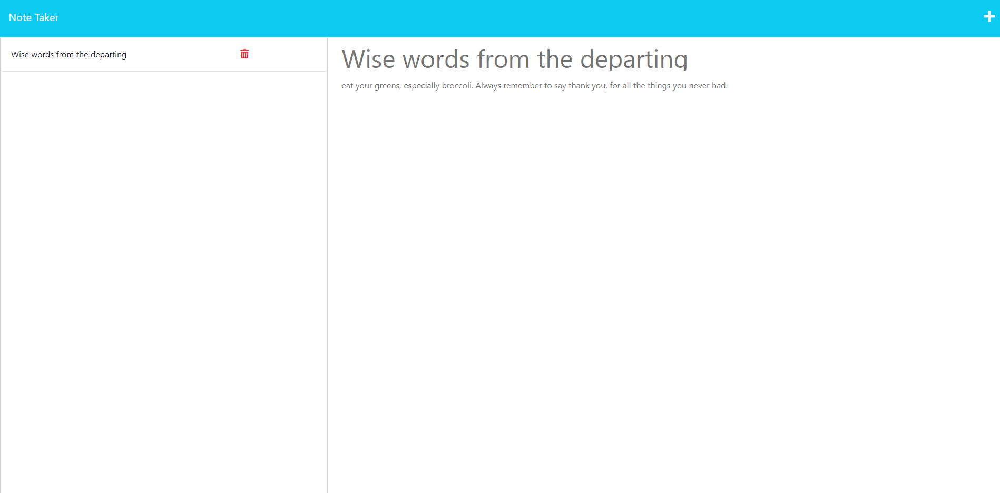
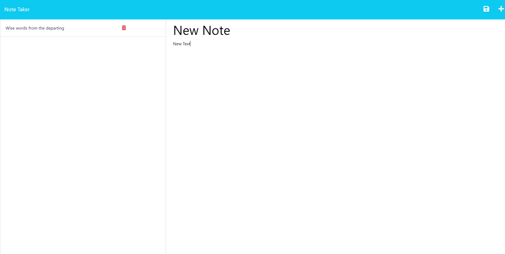
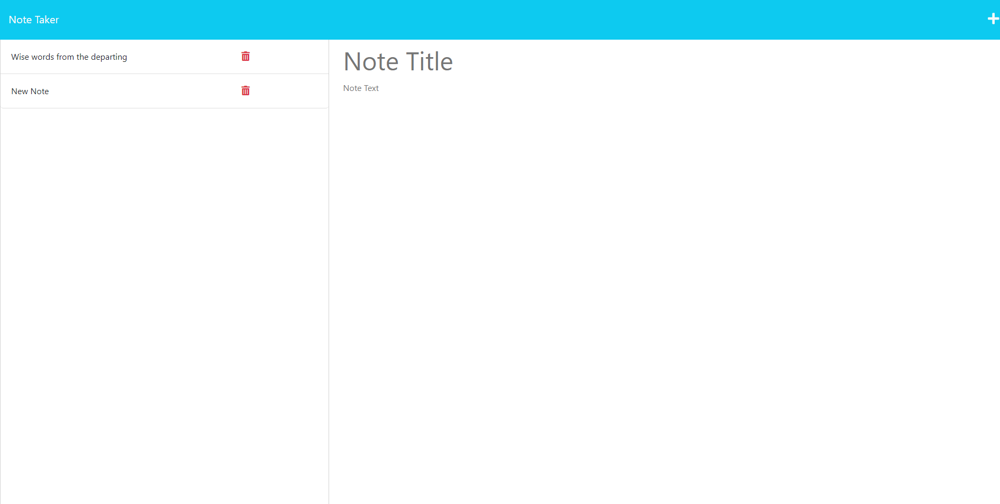
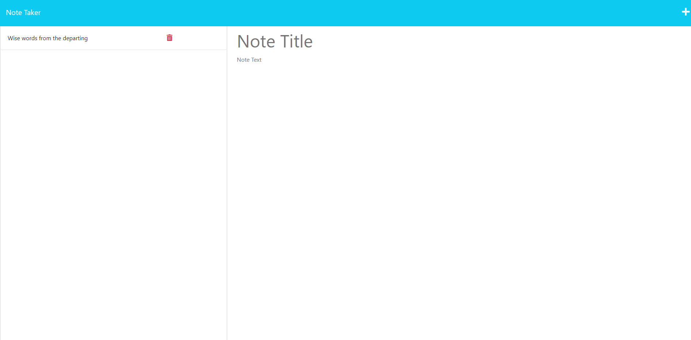

# Module-11 Note Taking Application

## Description

This is a web app that displays notes from a json acting as a database that the server has. Notes will be saved to the database and displayed from it.  I've added uuid so that no issues with notes having duplicate id's resulting in deleting multiple posts will happen.

## Installation

Everything is live on heroku at: [https://module-11-note-taker-app.herokuapp.com/](https://module-11-note-taker-app.herokuapp.com/)

If you want to run it locally, download the code, open bash in the root folder of the program, and

```sh
npm i
npm start
```

then go to localhost:3001 in any browser.

## Usage

Create notes in browser. Saves them to a json acting as a database. Loads the notes when the page is accessed.

Images below demonstrate functionality.

hitting / will take you to the index.


hitting /notes will take you to the notes page. Previously saved notes will be displayed.

Clicking on the note will display the saved text in the notepad section of the website.

Clicking the plus in the top right corner will allow you to create a new note.

Pressing the save button saves the note to the database. On refresh, the note will still be there.

Pressing the delete button deletes the note from the database.


## Contributing

This is a finished project and no further contribution is needed.

## Contact

[Github](https://github.com/LaurenWollaston)
[E-Mail](mailto:laurenofw@gmail.com)
